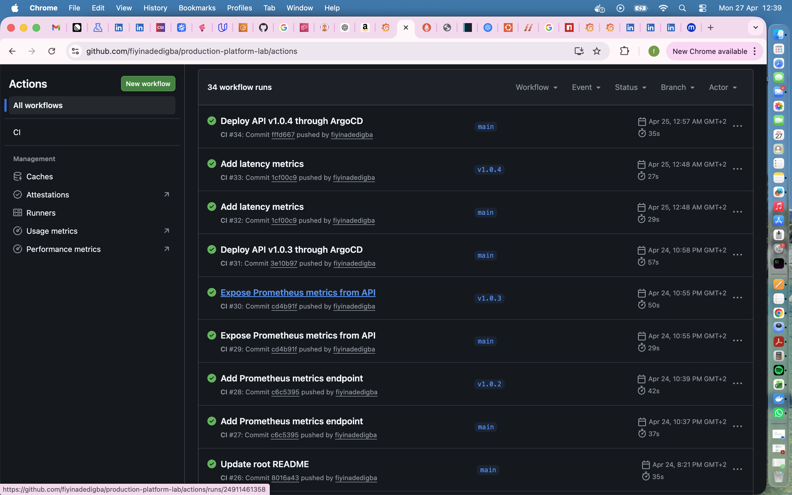
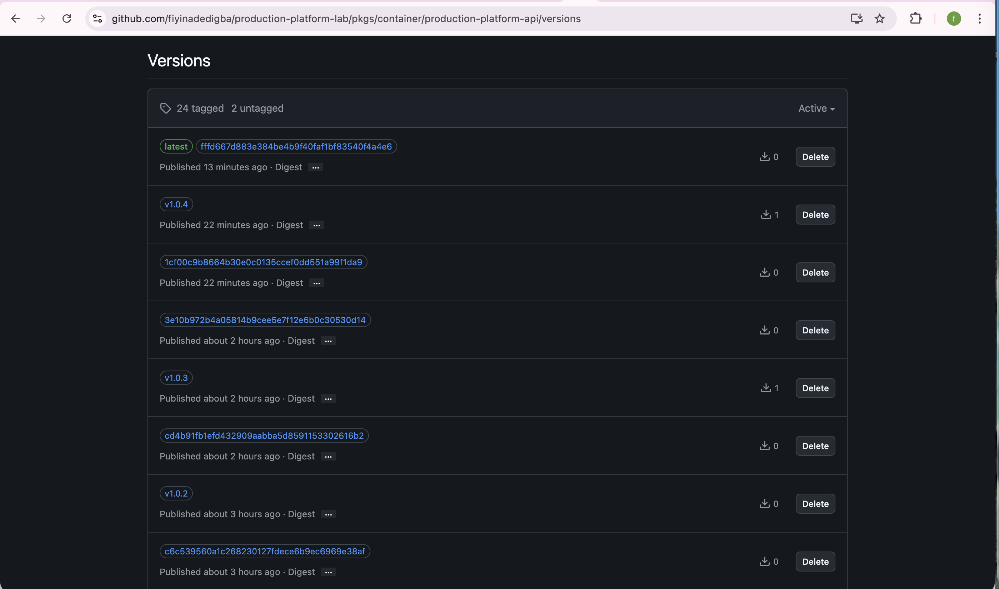
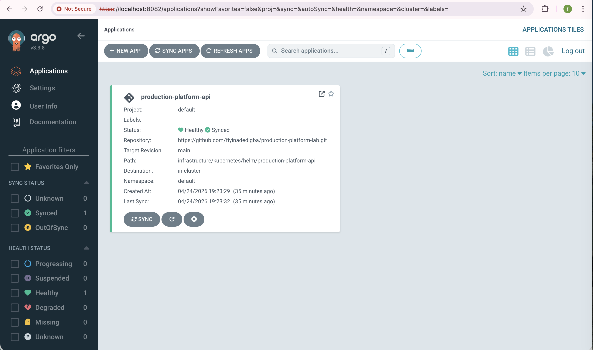
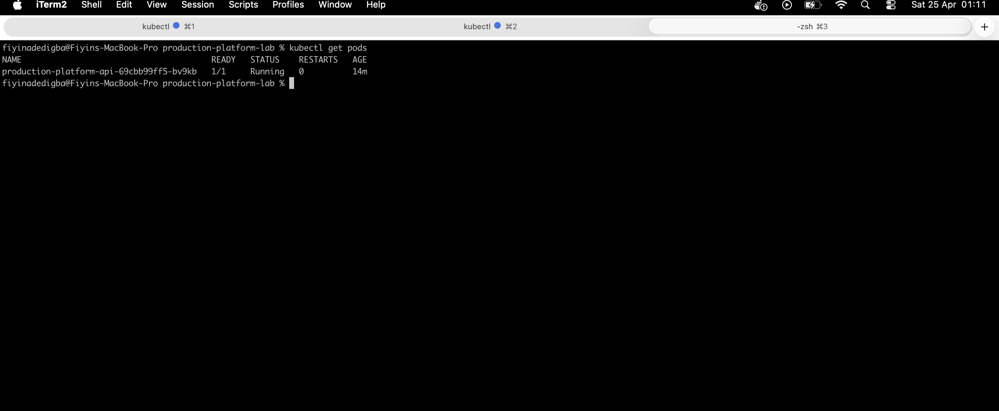
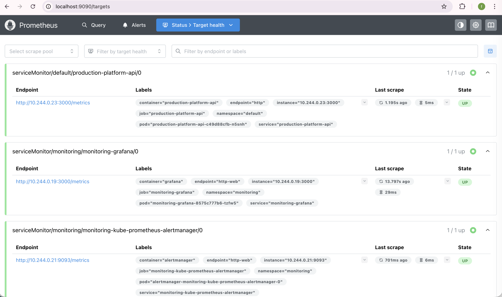
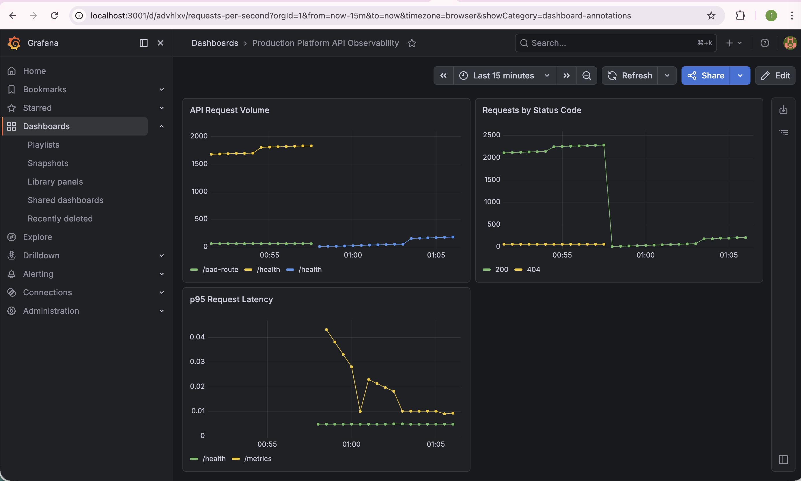

# Production Platform API with Observability 🚀

A production-style backend platform demonstrating end-to-end system design:

- CI/CD with GitHub Actions  
- Containerization with Docker  
- Kubernetes deployment using Helm  
- GitOps with ArgoCD  
- Automated image updates.
- Observability with Prometheus & Grafana
- AI-powered analysis endpoint for generating operational insights
---


## 🧭 End-to-End Flow

``` txt
Developer pushes code
↓
GitHub Actions builds & tests
↓
Docker image pushed to GHCR
↓
ArgoCD Image Updater detects new image version 
↓
Git is updated automatically
↓
ArgoCD syncs desired state
↓
Helm deploys to Kubernetes
↓
Prometheus scrapes metrics
↓
Grafana visualizes system health
↓
`/analyze` endpoint provides insights

```

---

```md
## 🏗️ Architecture


```
---
## 🚀 CI/CD Pipeline



Automated pipeline builds, tests, and publishes versioned Docker images.

---

## 📦 Container Registry (GHCR)



Images are versioned (`v1.x.x`) for reproducible deployments.

---
## 🔁 GitOps Deployment (ArgoCD)



ArgoCD continuously syncs the desired state from Git to Kubernetes.

---

## ☸️ Kubernetes Runtime



Application is deployed as a Kubernetes Deployment with a Service for networking.

---

## 📊 Observability



Metrics are collected and visualized in real time:

- Request volume  
- Error rates (status codes)  
- Latency (p95)  



---
## 🛠️ Tech Stack

- Node.js (Express)
- Docker
- Kubernetes (kind)
- Helm
- ArgoCD
- Prometheus
- Grafana
- GitHub Actions
- AI Integration (LLM-based analysis endpoint)

---

## 🚀 Getting Started

### Prerequisites

- Docker
- Kubernetes (kind)
- Helm
- kubectl
- Node.js

### Run Locally (development)

```bash
cd app
npm install
npm run dev
```
### Build and run with Docker
```bash
docker build -t production-platform-api .
docker run -p 3000:3000 production-platform-api

```
### Deploy to Kubernetes
```bash
kubectl apply -f gitops/argocd-apps/production-platform-api.yaml
```

### Access services
- **API**

```bash
kubectl port-forward svc/production-platform-api 8080:80
```

- **Grafana**

```bash
kubectl port-forward svc/monitoring-grafana -n monitoring 3001:80
```

- **ArgoCD**

```bash
kubectl port-forward svc/argocd-server -n argocd 8082:443
```
---
## ✨ Key Features

- Node.js API service
- Dockerized application
- CI pipeline with GitHub Actions
- Container images published to GitHub Container Registry (GHCR)
- Kubernetes deployment using Helm
- GitOps-based delivery with ArgoCD
- Automated image updates using ArgoCD Image Updater
- Observability with Prometheus and Grafana
- AI-powered analysis endpoint for system insights
---

## 🔁 Automated Image Updates

The platform uses ArgoCD Image Updater to automatically detect new container image versions in GHCR and update deployments via GitOps.

This removes the need for manual image tag changes and keeps deployments continuously in sync with the latest builds.

---
## 🤖 AI-Powered Analysis

The API includes an `/analyze` endpoint that provides operational insights based on input text (e.g., logs or metric summaries).

Example:

```bash
curl -X POST http://localhost:8080/analyze \
  -H "Content-Type: application/json" \
  -d '{"text":"Error rate increased and latency spiked"}'
```

**Response**
```JSON
{
  "analysis": "Elevated error rate detected. Investigate failing endpoints. Latency increase observed. Possible performance bottleneck."
}
```
>> Note: The AI response is mocked locally for development but designed to integrate with LLM providers.

---
## 📊 Observability

- Prometheus scrapes application metrics
- Grafana visualizes system performance
- Custom metrics include request latency and status codes

---

## ⚙️ Design Decisions

- **Helm**  
  Used for templated and reusable Kubernetes deployments.

- **ArgoCD**  
  Enables GitOps-based continuous delivery with Git as the source of truth.

- **GHCR (GitHub Container Registry)**  
  Integrated with GitHub Actions for seamless image publishing.

- **Versioned Docker Images**  
  Ensures reproducibility, traceability, and safe rollbacks.

---
## 🧱 GitOps Bootstrap (App of Apps)

The repository includes a basic App-of-Apps setup demonstrating how ArgoCD can manage both infrastructure and application deployments from Git.

A root application (root-app) references child applications, including:

- ArgoCD itself (via Helm)
- The API service

This pattern is commonly used to bootstrap and manage environments declaratively.

---

## 📁 Project Structure

production-platform-lab/
├── .github/workflows/             # CI pipelines (build & push images)
├── app/                           # Node.js API service
├── docs/                          # Documentation & screenshots
├── gitops/                        # GitOps configuration (ArgoCD)
│   ├── apps/                      # ArgoCD applicatioAPI + platform components)
│   ├── bootstrap/               App-of-apps root configurationern)
│   └── image-updater/           Automated image update configurationfig
├── infrastructure/
│   └── kubernetes/helm/
│       └── production-platform-api/   # Helm chart for API deployment
├── scripts/                       # Utility scripts
└── README.md
